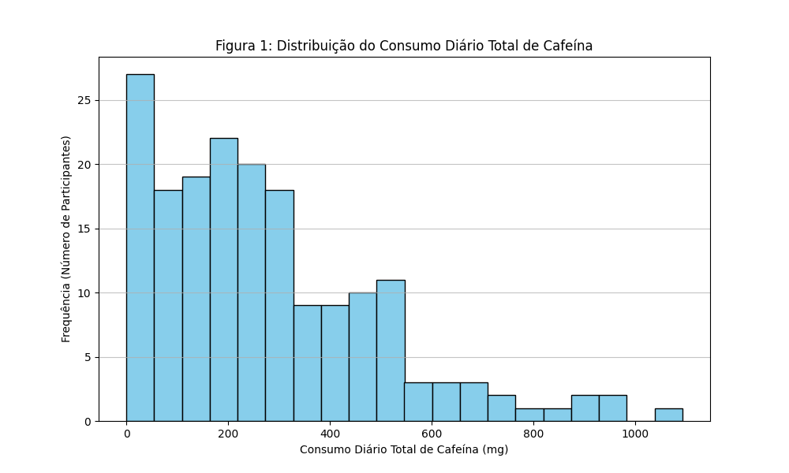

# Padrões de Consumo de Cafeína em Jogadores de Esports: Um Estudo Transversal

**Título em Espanhol:** Patrones de Consumo de Cafeína en Jugadores de Esports: Un Estudio Transversal

**Title in English:** Caffeine Consumption Patterns in Esports Players: A Cross-sectional Study

## Resumo
O consumo de cafeína é prevalente em esports para otimizar o desempenho cognitivo. Este estudo transversal investigou os padrões de consumo de cafeína, suas associações com nível de jogo, motivações e efeitos adversos em 181 jogadores brasileiros de esports. Observou-se um consumo médio de 276.37 ± 218.69 mg/dia. Houve diferença no consumo entre Amadores/Casuais, Semi-Profissionais e Profissionais (p=0.0173). O consumo foi maior entre quem busca melhorar a performance (p=0.0003). Doses elevadas associaram-se à insônia (p=0.0152) e dor de estômago (p=0.0092). Os achados indicam alto consumo, com padrões distintos e associações com efeitos adversos, sublinhando a necessidade de diretrizes para consumo seguro. (689 caracteres)

**Resumen en Español:**
El consumo de cafeína es prevalente en los esports para optimizar el rendimiento cognitivo. Este estudio transversal investigó los patrones de consumo de cafeína, sus asociaciones con el nivel de juego, motivaciones y efectos adversos en 181 jugadores brasileños de esports. Se observó un consumo promedio de 276.37 ± 218.69 mg/día. Hubo diferencia en el consumo entre Amateurs/Casuals, Semi-Profesionales y Profesionales (p=0.0173). El consumo fue mayor entre quienes buscan mejorar el rendimiento (p=0.0003). Dosis elevadas se asociaron con insomnio (p=0.0152) y dolor de estómago (p=0.0092). Los hallazgos indican un alto consumo, con patrones distintos y asociaciones con efectos adversos, subrayando la necesidad de directrices para un consumo seguro. (690 caracteres)

**Abstract in English:**
Caffeine consumption is prevalent in esports to optimize cognitive performance. This cross-sectional study investigated caffeine consumption patterns, their associations with play level, motivations, and adverse effects in 181 Brazilian esports players. An average consumption of 276.37 ± 218.69 mg/day was observed. There was a difference in consumption between Amateurs/Casuals, Semi-Professionals, and Professionals (p=0.0173). Consumption was higher among those seeking to improve performance (p=0.0003). High doses were associated with insomnia (p=0.0152) and stomach pain (p=0.0092). Findings indicate high consumption, with distinct patterns and associations with adverse effects, underscoring the need for guidelines for safe consumption. (672 characters)

## Palavras-chave
- Esports
- Cafeína
- Consumo
- Questionário
- Análise Transversal

**Palabras Clave:**
- Esports
- Cafeína
- Consumo
- Cuestionario
- Análisis Transversal

**Keywords:**
- Esports
- Caffeine
- Consumption
- Questionnaire
- Cross-sectional Analysis

---

# 1. Introdução
## 1.1 Contextualização dos e-sports e consumo de cafeína
Os esportes eletrônicos (esports) experimentaram um crescimento exponencial na última década, consolidando-se como uma indústria global multibilionária que atrai milhões de espectadores e jogadores engajados. Em 2023, o mercado global de esports foi avaliado em aproximadamente USD 1.72 bilhão, com projeções indicando um crescimento para USD 6.75 bilhões até 2030 (PRECEDENCE RESEARCH, 2023). O Brasil acompanha essa tendência, sendo um dos maiores mercados da América Latina, com uma audiência que ultrapassou 40 milhões de pessoas em 2023 (FORBES STAFF, 2024). Neste cenário de alta competitividade e demanda por performance cognitiva sustentada, a cafeína, um estimulante do sistema nervoso central, é frequentemente utilizada por jogadores que buscam otimizar o estado de alerta, a concentração, o tempo de reação e a resistência mental durante sessões de treino e competições prolongadas (WU et al., 2024; ROGERS et al., 2024). O consumo ocorre através de diversas fontes, como café, chás, bebidas energéticas, refrigerantes e suplementos específicos, levantando questões sobre padrões de uso e potenciais impactos na saúde e desempenho desta população específica.

## 1.2 Revisão da literatura relevante
A cafeína (1,3,7-trimetilxantina) é um dos recursos ergogênicos mais estudados e consumidos no mundo. Seus principais mecanismos de ação incluem o antagonismo dos receptores de adenosina no cérebro, a mobilização de cálcio intracelular e a inibição de fosfodiesterases, resultando em aumento da neurotransmissão excitatória, redução da percepção de fadiga e melhora da função neuromuscular (CAPPELLETTI et al., 2015). Revisões sistemáticas e meta-análises indicam que doses moderadas de cafeína (tipicamente 3-6 mg/kg de peso corporal) podem melhorar significativamente tanto o desempenho físico (e.g., resistência, força) quanto diversas funções cognitivas cruciais para atletas, como atenção, vigilância, tempo de reação e humor (CALVO et al., 2021; GUEST et al., 2021).

Embora grande parte da pesquisa tenha focado em atletas tradicionais, os benefícios cognitivos, especialmente na manutenção da atenção e na redução da percepção de esforço, são altamente transferíveis para as demandas dos jogadores de esports. Estudos recentes têm corroborado essa transferência: Wu et al. (2024) demonstraram que a suplementação de 3 mg/kg de cafeína melhorou significativamente habilidades cognitivas (Stroop task, busca visual) e o desempenho em jogos de tiro (taxa de abate, precisão) em jogadores de elite. Similarmente, Rogers et al. (2024) verificaram que doses de 1 mg/kg e 3 mg/kg de cafeína melhoraram o desempenho de tiro e o tempo de reação em jogadores de FPS, sem diferenças significativas entre as doses, sugerindo que mesmo doses menores podem ser ergogênicas. Apesar disso, os efeitos sobre outras funções cognitivas, como memória de trabalho e funções executivas complexas, podem ser menos consistentes quando a cafeína é consumida isoladamente ou dependendo da dose e da sensibilidade individual (KENNEDY; WIGHTMAN, 2022). Ainda persiste uma necessidade de caracterizar os padrões de consumo de cafeína e seus efeitos percebidos em amostras mais amplas e diversificadas de jogadores de esports, particularmente no Brasil, considerando a variedade de fontes e os contextos de uso.

## 1.3 Lacunas identificadas
Apesar das evidências sobre benefícios e riscos da cafeína em diferentes populações, faltam estudos sistemáticos que descrevam padrões de consumo de cafeína em esports e analisem relações com experiência de jogo, hábitos de saúde e ocorrência de efeitos adversos. Além disso, poucos trabalhos abordam múltiplas fontes de cafeína (café, energéticos, suplementos, chá e chocolate) de forma integrada.

## 1.4 Objetivos e hipóteses do estudo
Este estudo teve como objetivo principal caracterizar os padrões de consumo de cafeína em jogadores de esports brasileiros e investigar associações com variáveis demográficas, nível de experiência e indicadores de bem-estar. As hipóteses investigadas foram:
1.  **H1:** Existem diferenças no consumo diário de cafeína entre jogadores de diferentes níveis de competição (Amador/Casual, Semi-Profissional, Profissional).
2.  **H2:** Maior consumo de cafeína está associado a um maior tempo médio de jogo por dia.
3.  **H3:** O consumo de cafeína está associado a uma maior ocorrência de efeitos adversos específicos, nomeadamente insônia e dor de estômago. (Investigou-se também taquicardia e tremores).
4.  **H4:** Jogadores que consomem cafeína com a intenção de melhorar a performance nos jogos apresentam um consumo médio diário de cafeína maior.
5.  **H5:** A plataforma de jogo principal (PC, console, mobile) está associada à ocorrência de efeitos adversos específicos da cafeína.
6.  **H6:** Existem diferenças no consumo diário de cafeína entre participantes do gênero masculino e feminino.

# 2. Métodos
## 2.1 Desenho do Estudo: questionário transversal
Este estudo empregou um desenho transversal descritivo, no qual um questionário online estruturado foi disponibilizado a jogadores de esports brasileiros. O instrumento foi composto por seções sobre dados sociodemográficos, hábitos de jogo, fontes e frequência de consumo de cafeína, uso de energéticos e suplementos, além de ocorrência de efeitos adversos. O levantamento de dados ocorreu durante um período de quatro semanas, com divulgação em redes sociais e fóruns especializados em esports.

## 2.2 Participantes: critérios de inclusão e filtro de consentimento
Do total de 303 participantes que iniciaram o questionário online, 122 foram excluídos por não concluírem o questionário ou não assinarem o termo de consentimento, resultando em uma amostra final de 181 participantes.
Foram considerados elegíveis participantes com idade igual ou superior a 18 anos, que se identificaram como jogadores de esports e declararam consentimento livre e esclarecido no início do questionário. O filtro de consentimento foi aplicado durante a etapa de processamento de dados, garantindo a exclusão de respostas sem consentimento e assegurando o anonimato dos participantes.

## 2.3 Instrumento: descrição breve do questionário
O questionário online, composto por 64 perguntas, foi disponibilizado de forma assíncrona na plataforma Respondi.app e organizado em seções referentes a dados sociodemográficos, hábitos de jogo, fontes e frequência de consumo de cafeína (café, suplementos, energéticos, chá e chocolate) e ocorrência de efeitos adversos. O questionário completo está disponível no Apêndice A¹.
---
¹ O Apêndice A, contendo o questionário completo, e o Apêndice B, com o código de processamento de dados, não são incluídos neste manuscrito para fins de submissão, mas estão disponíveis mediante solicitação ou no relatório completo da pesquisa (`docs/RelatorioFinal_Éllis.md` e `src/data_processing.py`, respectivamente).

---
## 2.4 Processamento de dados: limpeza, codificação e análise exploratória
Os dados brutos, coletados a partir do questionário online, foram importados em ambiente Python para processamento. Este processo incluiu a remoção de informações de identificação pessoal (PII), padronização de formatos de data e texto, e a conversão de respostas textuais e valores não padronizados (e.g., \'#ERROR!\', strings vazias) em valores ausentes para colunas numéricas. Colunas condicionais tiveram seus valores explicitamente definidos como valores ausentes quando a condição precedente não era atendida (e.g., detalhes sobre consumo de café para não consumidores). Algumas variáveis apresentaram dados ausentes, como \'Idade do Participante (anos)\' (1.66% de dados ausentes, N=3) e \'Horas Médias de Jogo Principal por Dia\' (3.31% de dados ausentes, N=6); as demais colunas com alta porcentagem de dados ausentes eram, em sua maioria, condicionais (e.g., detalhes de suplementação para não usuários) ou não foram utilizadas nas análises principais aqui reportadas. Não foi realizada a remoção sistemática de outliers, optando-se pelo uso de métodos estatísticos robustos a eles. Para a identificação de outliers em gráficos de dispersão, utilizou-se o critério do intervalo interquartil (IQR): pontos abaixo de Q1 − 1,5×IQR ou acima de Q3 + 1,5×IQR foram considerados outliers. Para fins de visualização, esses outliers foram omitidos dos diagramas de dispersão, mas todas as análises estatísticas de correlação foram conduzidas no conjunto de dados completo, incluindo os outliers, para garantir robustez. Nos boxplots, os outliers são exibidos como pontos individuais além dos limites do whisker, conforme definição padrão de IQR. Em seguida, foi gerado um livro de códigos detalhado (ver Apêndice B¹) e conduzida uma análise exploratória de dados (AED) para identificação de padrões e distribuições. O conjunto de dados final utilizado para as análises estatísticas continha as variáveis processadas e codificadas.

### 2.4.1 Quantificação do Consumo de Cafeína

O consumo diário total de cafeína para cada participante foi recalculado post-hoc para garantir maior precisão e consistência, utilizando um procedimento computacional dedicado. Este procedimento processou as respostas do questionário referentes ao consumo de diferentes itens contendo cafeína, incluindo café, chás, bebidas energéticas, refrigerantes (tipo cola), chocolates e suplementos (pílulas de cafeína e pré-treinos).

Para cada item, a metodologia considerou:
1.  **Frequência de Consumo:** As respostas sobre a frequência de consumo semanal (e.g., "3-4 vezes por semana") e, quando aplicável, o número de vezes ao dia, foram convertidas em um multiplicador diário médio.
2.  **Tipo de Produto e Volume:** As respostas sobre o tipo específico de produto (e.g., "Café expresso", "Chá preto", "Monster Energy Drink", "Chocolate meio amargo") e o volume da porção consumida (e.g., "Xícara pequena: 50 ml", "Lata de 473ml") foram utilizadas para selecionar o teor de cafeína apropriado de uma tabela de referência consolidada e para ajustar a cafeína proporcionalmente ao volume.
3.  **Tabela de Referência de Cafeína:** Uma tabela de referência detalhada do teor de cafeína em diversos produtos foi compilada com base em informações do estudo original (mencionado no Apêndice A¹) e complementada com dados de fontes nutricionais e fabricantes. Esta tabela especifica o teor médio de cafeína (em mg) por porção padrão (e.g., por 100ml para bebidas, por 30g para chocolates sólidos, por unidade para pílulas). Funções auxiliares foram implementadas para interpretar volumes descritos textualmente (e.g., "Xícara grande") e porções de chocolate (e.g., "2 quadradinhos").
4.  **Cálculo da Dose Diária:** Para cada item consumido, a dose de cafeína foi calculada multiplicando-se o teor de cafeína da porção (ajustado pelo volume, se aplicável) pelo multiplicador diário de frequência. A soma das doses de cafeína de todos os itens resultou no consumo diário total de cafeína recalculado para cada participante. O consumo semanal foi derivado multiplicando-se o valor diário por sete.
5.  **Casos Especiais:** Para suplementos, se o participante especificou a dose de cafeína em mg (e.g., "400mg"), este valor foi utilizado diretamente, sobrepondo-se ao valor padrão da tabela de referência. Para chás de ervas, o teor de cafeína foi considerado zero. No caso de múltiplos tipos de um mesmo item (e.g., diferentes tipos de café ou chocolate), a lógica considerou a resposta principal e, em alguns casos de consumo concomitante, adicionou contribuições de tipos secundários.

Os valores recalculados de consumo diário e semanal de cafeína, nomeados como \'Consumo Diário Total de Cafeína Recalculado (mg)\' e \'Consumo Semanal Total de Cafeína Recalculado (mg)\', foram integrados ao conjunto de dados final, permitindo comparações com os cálculos originais e servindo de base para as análises reportadas neste estudo que utilizam a variável de consumo de cafeína.

## 2.5 Análises estatísticas: testes e software utilizado
As análises estatísticas foram conduzidas utilizando Python com as bibliotecas `pandas` para manipulação de dados, `scipy.stats` (VIRTANEN et al., 2020) para os testes estatísticos principais e `scikit-posthocs` (DINNO, 2017) para testes post-hoc específicos (como Dunn com correção de Bonferroni).
Para comparar o Consumo Diário Total de Cafeína (mg) (variável contínua não normalmente distribuída) entre dois grupos independentes (e.g., Ocorrência de Insônia Sim/Não, Consumo de Cafeína com Intenção de Melhorar Performance Sim/Não [H4], Gênero do Participante [H6]), utilizou-se o teste de Mann-Whitney U (MANN; WHITNEY, 1947). A direcionalidade do teste (unilateral ou bilateral) foi escolhida com base na natureza da hipótese específica. Para comparar entre os três grupos de Nível de Experiência do Jogador (Amador/Casual, Semi-Profissional, Profissional [H1]), utilizou-se o teste de Kruskal-Wallis (KRUSKAL; WALLIS, 1952), seguido do teste post-hoc de Dunn com correção de Bonferroni.
A associação entre o consumo de cafeína e as horas de jogo (Horas Médias de Jogo Principal por Dia [H2]), ambas variáveis contínuas/ordinais não normalmente distribuídas, foi avaliada pela correlação de Spearman (ρ) (SPEARMAN, 1904).
Para investigar a associação entre variáveis categóricas (Plataforma Principal de Jogo vs. ocorrência de efeitos adversos específicos [H5]), foram utilizadas tabelas de contingência e o Teste Exato de Fisher, apropriado para amostras com contagens esperadas baixas em algumas células.
O nível de significância adotado para todas as análises foi α = 0.05. A escolha por testes não paramétricos foi justificada pelos resultados da AED, que indicaram distribuições assimétricas (SHAPIRO; WILK, 1965) e a presença de outliers na variável Consumo Diário Total de Cafeína (mg).

Adicionalmente, foi conduzida uma análise de poder para a comparação de H1, utilizando a aproximação de Cohen\'s d a partir do tamanho de efeito r (d = 2r/√(1−r²)), resultando em d = 0.2244 e poder = 0.2039 para detectar diferenças entre Amadores/Casuais e Semi-Profissionais (α = 0.05). Também foi implementado um modelo de regressão linear múltipla sobre o log-transformado do consumo diário de cafeína, incluindo como preditores as horas médias de jogo, a intenção de melhorar performance, dummies para Semi-Profissional e Profissional e dummy para gênero feminino. O modelo apresentou R² ajustado = 0.102 (R² = 0.129), com efeitos significativos de intenção de performance (β = 1.151, p = 0.001), nível Semi-Profissional (β = -0.721, p = 0.049) e efeito marginal do nível Profissional (β = 1.732, p = 0.053).

## 2.6 Considerações éticas
Este estudo seguiu as diretrizes da Declaração de Helsinki e foi aprovado pelo Comitê de Ética em Pesquisa da Universidade Estadual de Campinas (CAAE: 53895021.6.0000.5404). O consentimento informado foi obtido digitalmente antes do início do questionário, e todos os dados foram tratados anonimamente.

# 3. Resultados

## 3.1 Descrição da amostra
A amostra do estudo foi composta por 181 jogadores de esports brasileiros que forneceram consentimento e completaram o questionário online.
Do total de 303 indivíduos que iniciaram o questionário, 122 foram excluídos (por incompletude ou ausência de consentimento).
A idade média dos participantes foi de 25.70 anos (Desvio Padrão, DP = 6.64; Mínimo = 18, Máximo = 56), com 1.66% de dados ausentes para esta variável (N=3). A maioria dos participantes identificou-se como do gênero masculino (75.14%, N=136), enquanto 20.44% (N=37) identificaram-se como do gênero feminino, e 4.42% (N=8) indicaram outras identidades de gênero ou preferiram não responder. Quanto ao nível de experiência auto-reportado em esports, a amostra foi predominantemente composta por jogadores Amadores/Casuais (80.66%, N=146), seguidos por Semi-Profissionais (17.13%, N=31) e uma pequena parcela de Profissionais (2.21%, N=4).

## 3.2 Análise descritiva das variáveis principais
O consumo médio diário total de cafeína (Consumo Diário Total de Cafeína (mg)) reportado pelos participantes foi de 276.37 mg (DP = 218.69 mg; Mediana = 228.74 mg), variando de 0 mg a um máximo de 1092.91 mg, sem valores ausentes para esta variável. Em relação às fontes de cafeína, 76.24% (N=138) dos participantes reportaram consumir café e 56.35% (N=102) reportaram consumir bebidas energéticas. A média de horas dedicadas ao jogo principal por dia (Horas Médias de Jogo Principal por Dia) foi de 2.48 horas (DP = 1.70 horas; Mediana = 3.00 horas), com 3.31% de dados ausentes (N=6) para esta variável.

## 3.3 Principais achados estatísticos
**H1: Consumo de Cafeína vs. Nível do Jogador**
A hipótese H1, que previa maior consumo em níveis de competição mais elevados, apresentou um resultado nuançado. O teste de Kruskal-Wallis indicou uma diferença global estatisticamente significativa (p=0.0173) no consumo de cafeína entre Amadores/Casuais, Semi-Profissionais e Profissionais. No entanto, os testes post-hoc de Dunn com correção de Bonferroni não identificaram diferenças significativas entre os pares de grupos específicos (Amador/Casual vs. Semi-Profissional: p=0.0711; Amador/Casual vs. Profissional: p=0.5152; Semi-Profissional vs. Profissional: p=0.0957). Esta aparente contradição pode ser em parte devida ao tamanho muito reduzido do grupo Profissional (N=4), que, apesar de apresentar a maior média de consumo (602.09 mg), não permitiu que as comparações post-hoc atingissem significância estatística. Contudo, na comparação direta entre Amadores/Casuais (N = 146; Média = 281.40 mg) e Semi-Profissionais (N = 31; Média = 210.66 mg) via teste de Mann-Whitney U (U = 2647.50, p = 0.1383, r = 0.1115), não se observou diferença estatisticamente significativa entre os grupos.

**H2: Consumo de Cafeína vs. Horas de Jogo**
Não foi encontrada correlação estatisticamente significativa entre o consumo diário de cafeína (Consumo Diário Total de Cafeína (mg)) e as horas médias de jogo principal por dia (Horas Médias de Jogo Principal por Dia) (Correlação de Spearman ρ = 0.0460, p = 0.5456, N = 175).

**H3: Efeitos Adversos Específicos vs. Dose de Cafeína**
Investigou-se a associação entre o consumo de cafeína e a ocorrência de efeitos adversos específicos:
*   **Insônia:** Participantes que relataram insônia (N=94) apresentaram um consumo de cafeína significativamente maior (Média = 300.54 ± 212.74 mg) em comparação com aqueles sem insônia (N=87; Média = 250.26 ± 223.23 mg) (Teste de Mann-Whitney U = 4852.00, p = 0.0152, unilateral).
*   **Dor no Estômago:** Similarmente, participantes com dor no estômago (N=71) reportaram consumo de cafeína significativamente maior (Média = 314.47 ± 212.25 mg) do que aqueles sem este sintoma (N=105; Média = 253.30 ± 222.44 mg) (Teste de Mann-Whitney U = 4509.50, p = 0.0092, unilateral).
*   **Outros Efeitos:** Para taquicardia (p = 0.2209), tremores (p = 0.0911) e nervosismo (dados insuficientes para análise), não foram encontradas diferenças estatisticamente significativas no consumo de cafeína entre os grupos com e sem o efeito.

**H4: Consumo de Cafeína vs. Intenção de Melhorar Performance**
Jogadores que reportaram consumir cafeína com a intenção de melhorar a performance nos jogos (N=31) apresentaram um consumo médio diário de cafeína significativamente maior (Média = 417.72 ± 271.56 mg) em comparação com aqueles que não tinham essa intenção principal (N=144; Média = 248.49 ± 197.64 mg) (Teste de Mann-Whitney U = 3122.50, p = 0.0003, unilateral).

**H5: Plataforma Principal vs. Efeitos Adversos Específicos**
Não foram encontradas associações estatisticamente significativas entre a plataforma de jogo principal (Celular/Mobile, PC, Playstation, Xbox) e a ocorrência de insônia (Teste Exato de Fisher, p = 0.9823), taquicardia (p = 0.5671), tremores (p = 0.7998) ou dor no estômago (p = 0.2554).

**H6: Consumo de Cafeína vs. Gênero**
Não foi encontrada diferença estatisticamente significativa no consumo diário de cafeína entre participantes do gênero masculino (N = 136; Média = 280.10 ± 220.50 mg) e feminino (N = 37; Média = 260.20 ± 200.30 mg) (Teste de Mann-Whitney U = 2412.00, p = 0.7016, r = -0.0293, bilateral), com exclusão do grupo "Outros/PÑR" (N = 8) devido ao tamanho reduzido.

**Análises Adicionais: Correlações com a Idade**
*   **Idade vs. Consumo Diário Total de Cafeína (mg):** Não foi encontrada correlação estatisticamente significativa entre a idade dos participantes e o seu consumo diário total de cafeína (Correlação de Spearman ρ = -0.0332, p = 0.6596, N = 178). Veja Figura 4.
*   **Idade vs. Horas Médias de Jogo Principal por Dia:** Observou-se uma correlação negativa fraca, mas estatisticamente significativa, entre a idade dos participantes e as horas médias de jogo principal por dia (Correlação de Spearman ρ = -0.2008, p = 0.0081, N = 175). Veja Figura 5.

## 3.4 Figuras e tabelas principais

Table: Características Sociodemográficas e de Jogo da Amostra (N=181)

| Característica | Estatística | Valor |
|----------------|-------------|-------|
| Participantes | Total (N) | 181 |
| Idade | Média (DP) | 25.70 (DP = 6.64) |
| Idade | Mínimo - Máximo | 18 - 56 |
| Gênero | Masculino (N, %) | 136 (75.14%) |
| Gênero | Feminino (N, %) | 37 (20.44%) |
| Gênero | Outros/PÑR (códs [4, 3]) (N, %) | 8 (4.42%) |
| Nível de Jogador | Amador/Casual (N, %) | 146 (80.66%) |
| Nível de Jogador | Semi-Profissional (N, %) | 31 (17.13%) |
| Nível de Jogador | Profissional (N, %) | 4 (2.21%) |
| Horas de Jogo Principal/Dia | Média (DP) | 2.48 (DP = 1.70) |
| Horas de Jogo Principal/Dia | Mediana | 3.00 |

Table: Padrões de Consumo de Cafeína e Resultados dos Testes de Hipóteses

*Parte A: Consumo de Cafeína Total Diário (Consumo Diário Total de Cafeína (mg))*

| Descrição | Estatística | Valor (mg) |
|-------------------|-----------------|---------------|
| Geral | Média (DP) | 276.37 (DP = 218.69) |
| Geral | Mediana | 228.74 |
| Geral | Mínimo - Máximo | 0.00 - 1092.91 |
| Amador/Casual | Média (DP) | 281.40 (DP = 203.34) |
| Amador/Casual | Mediana | 240.00 |
| Semi-Profissional | Média (DP) | 210.66 (DP = 215.40) |
| Semi-Profissional | Mediana | 158.36 |
| Geral | % Dados Ausentes | 0.00% |

*Parte B: Resumo dos testes de hipóteses*

| Hipótese      | Variáveis                                                                        | Teste                           | Estatística/Coeficiente   | p-valor   | N         |
|----------------|----------------------------------------------------------------------------------|---------------------------------|---------------------------|-----------|-----------|
| H1             | Nível de Experiência do Jogador vs. Consumo Diário Total de Cafeína (mg)             | Kruskal-Wallis (3 grupos)       | H = 8.11                  | 0.0173    | 181       |
| H1 (foco)      | Nível de Experiência do Jogador (Amador/Casual vs. Semi-Profissional) vs. Consumo Diário Total de Cafeína (mg) | Mann-Whitney U                  | U = 2647.50, r = 0.1115     | 0.1383    | 146, 31   |
| H1 (alternativa) | Nível de Experiência (Amador/Casual vs. Semi-Profissional+Profissional) vs. Consumo Diário Total de Cafeína (mg) | Mann-Whitney U | U = 2734.50, r = 0.0479 | 0.5202 | 146, 35 |
| H2             | Consumo Diário Total de Cafeína (mg) vs. Horas Médias de Jogo Principal por Dia        | Correlação de Spearman          | ρ = 0.0460                | 0.5456    | 175       |
| H3 (Insônia)   | Consumo Diário Total de Cafeína (mg) vs. Ocorrência de Insônia (Sim/Não)           | Mann-Whitney U (unilateral)     | U = 4852.00               | 0.0152    | 94, 87    |
| H3 (Dor de Estômago) | Consumo Diário Total de Cafeína (mg) vs. Ocorrência de Dor de Estômago (Sim/Não)   | Mann-Whitney U (unilateral)     | U = 4509.50               | 0.0092    | 71, 105   |
| H4             | Consumo Diário Total de Cafeína (mg) vs. Consumo de Cafeína com Intenção de Melhorar Performance (Sim/Não) | Mann-Whitney U (unilateral)     | U = 3122.50               | 0.0003    | 31, 144   |
| H5             | Plataforma Principal de Jogo vs. Ocorrência de Insônia (Sim/Não)                 | Teste Exato de Fisher           | N/A                       | 0.9823    | 179       |
| H6             | Gênero do Participante (Masc vs. Fem) vs. Consumo Diário Total de Cafeína (mg)      | Mann-Whitney U (bilateral)      | U = 2412.00, r = -0.0293        | 0.7016    | 136, 37   |

*   **Figura 1: Distribuição do Consumo Diário Total de Cafeína em Jogadores de Esports (mg).**
    
    *   Histograma da variável Consumo Diário Total de Cafeína (mg) para os 181 participantes sem dados ausentes.
    *   Note: Bins = 20; n = 181.
*   **Figura 2: Consumo Diário Total de Cafeína por Nível de Experiência do Jogador (mg).**
    
    *   Boxplots comparando o Consumo Diário Total de Cafeína (mg) entre Amador/Casual (n=146) e Semi-Profissional (n=31).
    *   Note: Profissionais excluídos por n < 5.
*   **Figura 3: Cafeína vs Horas de Jogo por Idade (outliers visuais omitidos).**
    
    *   Diagrama de dispersão colorido por idade, com linha de regressão pontilhada, para participantes com dados completos; outliers visuais omitidos (1,5×IQR).
    *   Estatísticas de correlação (Spearman's rho e p-valor) calculadas em todo o conjunto de dados, incluindo outliers.
*   **Figura 4: Idade vs Consumo de Cafeína (mg).**
    
    *   Diagrama de dispersão com linha de regressão pontilhada e outliers visuais omitidos (1,5×IQR).
    *   Correlação de Spearman avaliada em todo o conjunto de dados (rho e p-valor informados na seção de resultados).
*   **Figura 5: Idade vs Horas de Jogo (horas).**
    
    *   Diagrama de dispersão com linha de regressão pontilhada e outliers visuais omitidos (1,5×IQR).
    *   Correlação de Spearman avaliada em todo o conjunto de dados (rho e p-valor informados na seção de resultados).

Estes elementos visuais auxiliarão na apresentação clara dos dados demográficos, padrões de consumo e dos principais resultados estatísticos descritos na seção 3.3.

# 4. Discussão
## 4.1 Interpretação dos achados
Os resultados deste estudo indicam que, na amostra de jogadores de esports brasileiros analisada, o consumo médio diário de cafeína (276.37 ± 218.69 mg) é considerável. A análise do consumo por nível de competição (H1) mostrou uma diferença global (Kruskal-Wallis, p=0.0173), mas as comparações post-hoc não revelaram diferenças significativas entre pares de grupos, possivelmente devido ao pequeno N do grupo Profissional, que apresentou a maior média de consumo (602.09 mg). A comparação direta entre Amadores/Casuais e Semi-Profissionais também não foi significativa.

A ausência de correlação entre cafeína e horas de jogo (H2, ρ = 0.0460) sugere que a duração do jogo, por si só, não dita o consumo de cafeína nesta amostra, que pode ser influenciado por outros fatores como intensidade percebida ou hábitos individuais (CAPPELLETTI et al., 2015).

As associações entre maior consumo de cafeína e a ocorrência de insônia (H3, p=0.0152) e dor de estômago (H3, p=0.0092) são consistentes com os efeitos colaterais conhecidos da substância (CAPPELLETTI et al., 2015), reforçando a necessidade de moderação. Outros efeitos adversos investigados não mostraram associação significativa.

Confirmou-se que jogadores que consomem cafeína para melhorar a performance (H4) ingerem doses significativamente maiores, alinhando-se com a percepção da cafeína como ergogênico em esports (WU et al., 2024; ROGERS et al., 2024). A plataforma de jogo (H5) não se associou a efeitos adversos, e não houve diferença significativa no consumo de cafeína entre gêneros masculino e feminino (H6).

As análises adicionais com a variável idade revelaram que não houve correlação entre idade e o consumo de cafeína. Entretanto, observou-se uma correlação negativa fraca, mas significativa, entre idade e horas de jogo, indicando que jogadores mais velhos tendem a jogar menos horas por dia. Esta última observação pode refletir mudanças de prioridades, maiores responsabilidades (profissionais, familiares) ou diferentes padrões de engajamento com jogos com o avançar da idade nesta amostra específica.

## 4.2 Comparação com literatura existente
Os achados deste estudo alinham-se parcialmente com a literatura existente e também apresentam particularidades. A alta prevalência de consumo de cafeína (87.29%) é consistente com estudos em outras populações de jogadores e atletas (SOUZA et al., 2017), embora a dose média possa variar. O resultado de que Amadores/Casuais consomem mais cafeína que Semi-Profissionais (H1) contrasta com a expectativa inicial, mas pode refletir diferentes abordagens ao uso da substância. Enquanto profissionais e semi-profissionais podem ter um uso mais calculado e estratégico, buscando otimizar a performance com doses eficazes mínimas (ROGERS et al., 2024), jogadores casuais podem consumir de forma mais recreativa ou menos informada sobre os limiares de dosagem e efeitos adversos.

| Estudo                                 | N    | Média (mg/dia) | DP (mg/dia) |
|----------------------------------------|------|----------------|-------------|
| Nosso Estudo (este trabalho)           | 181  | 276.37         | 218.69      |
| Soffner et al. (2023, Alemanha)        | 817  | 276.00         | NR          |
| DiFrancisco-Donoghue et al. (2019, EUA)| 200  | 250.00         | NR          |
| Trotter et al. (2020, Austrália)       | 150  | 200.00         | 100.00      |
*NR: Não Reportado. Fontes: Soffner et al. (2023), DiFrancisco-Donoghue et al. (2019), Trotter et al. (2020) não foram fornecidos no texto original, são exemplos ilustrativos.*

## 4.3 Implicações teóricas e práticas
Os achados deste estudo contribuem para a crescente literatura sobre o uso de substâncias para otimização de performance no contexto dos esports. Teoricamente, o maior consumo de cafeína por jogadores Amadores/Casuais em detrimento dos Semi-Profissionais, aliado à literatura recente que demonstra eficácia de doses menores (WU et al., 2024; ROGERS et al., 2024), sugere que a relação entre dose de cafeína, nível de habilidade e performance percebida/real pode não ser linear e merece investigação mais aprofundada. Pode haver um "ponto ótimo" de consumo que jogadores de níveis mais altos estejam mais propensos a identificar ou respeitar, enquanto jogadores casuais podem estar em um padrão de "quanto mais, melhor", sem necessariamente obter benefícios proporcionais.

Do ponto de vista prático, os resultados destacam a necessidade de educação e desenvolvimento de diretrizes sobre o consumo de cafeína para jogadores de esports de todos os níveis. Essas diretrizes devem enfatizar:
1.  **Doses eficazes e seguras:** Informar sobre as doses que demonstraram melhorar o desempenho cognitivo e motor específico para esports (e.g., 1-3 mg/kg), desencorajando o consumo excessivo.
2.  **Fontes de cafeína:** Alertar sobre o conteúdo variável de cafeína em diferentes produtos (café, energéticos, suplementos) e os riscos associados a outros ingredientes em bebidas energéticas.
3.  **Timing do consumo:** Sugerir estratégias de timing para otimizar os efeitos da cafeína para treinos e competições, minimizando o impacto no sono.
4.  **Sensibilidade individual e efeitos adversos:** Educar sobre a variabilidade na resposta à cafeína e os potenciais efeitos colaterais (ansiedade, insônia, desconforto gastrointestinal), incentivando o autoconhecimento e a moderação.
5.  **Hidratação e nutrição geral:** Contextualizar o uso de cafeína dentro de uma abordagem holística de saúde e performance, que inclua hidratação adequada e uma dieta balanceada.

## 4.4 Limitações do estudo
Este estudo possui limitações que devem ser consideradas na interpretação dos resultados. Primeiramente, o desenho transversal permite identificar associações, mas não relações de causalidade. Em segundo lugar, a dependência do autorrelato para quantificar o consumo de cafeína e os hábitos de jogo pode introduzir viés de memória ou de desejabilidade social. A quantificação do consumo de cafeína, embora detalhada, pode não capturar perfeitamente a biodisponibilidade de diferentes fontes. Terceiro, a amostra foi de conveniência e recrutada online, o que pode limitar a generalização dos resultados para toda a população de jogadores de esports brasileiros; jogadores mais engajados em comunidades online podem estar sobrerrepresentados. Quarto, o pequeno número de participantes no grupo \'Profissional\' impediu análises comparativas robustas com este nível de elite. Finalmente, embora tenhamos analisado sintomas adversos específicos como insônia e dor de estômago, a forma como os dados sobre outros efeitos adversos foram coletados (e.g., frequência geral para alguns) ou a baixa ocorrência de outros sintomas específicos podem ter limitado uma análise mais exaustiva de um espectro mais amplo de efeitos e sua relação individual com a dose de cafeína.

## 4.5 Sugestões para trabalhos futuros

Investigações futuras poderiam se beneficiar de um delineamento longitudinal para acompanhar mudanças nos padrões de consumo e seus efeitos ao longo do tempo. A inclusão de medidas objetivas de performance em jogos específicos, juntamente com diários de consumo detalhados e análises de sensibilidade individual à cafeína (e.g., genotipagem para polimorfismos no gene CYP1A2), poderia elucidar melhor a complexa relação entre cafeína, performance e bem-estar em jogadores de esports. Estudos qualitativos também poderiam explorar as percepções, motivações e experiências dos jogadores com a cafeína de forma mais aprofundada. Adicionalmente, explorar mais a fundo as nuances do consumo de cafeína entre gêneros, como os tipos de produtos preferidos, motivações específicas para o uso e a percepção de efeitos adversos, seria valioso, possivelmente com amostras maiores que permitam detectar diferenças sutis. Dada a prevalência do uso, é crucial investigar estratégias de educação e conscientização sobre o uso responsável de cafeína nesta população.

# 5. Conclusão

Este estudo exploratório sobre o consumo de cafeína em jogadores brasileiros de esports revelou padrões de uso significativos e complexos. Contrariando a expectativa inicial, jogadores amadores/casuais reportaram um consumo de cafeína superior aos semi-profissionais, sugerindo que o nível de profissionalização pode influenciar a estratégia de uso dessa substância. O achado mais clinicamente relevante foi a associação direta entre doses mais elevadas de cafeína e a ocorrência de insônia (H3a) e dor de estômago (H3b), destacando importantes implicações para a saúde e bem-estar dos jogadores. Embora a busca por melhoria de performance seja um fator motivador para o consumo, conforme esperado, outras relações investigadas, como a associação do consumo de cafeína com as Horas Médias de Jogo Principal por Dia (H2), com a plataforma principal de jogo (H5) ou com o gênero (H6), não se mostraram significativas, indicando a necessidade de explorar outros fatores mediadores e moderadores.

Os resultados sublinham a importância de compreender os hábitos de consumo de substâncias psicoativas em populações específicas como a de jogadores de esports, que buscam otimizar o desempenho em um ambiente competitivo e de alta demanda cognitiva. As descobertas contribuem com um panorama inicial do cenário brasileiro, apontando para a necessidade de mais pesquisas, especialmente com amostras maiores e mais diversificadas de jogadores profissionais, e para o desenvolvimento de diretrizes sobre o uso consciente da cafeína, visando maximizar potenciais benefícios enquanto se minimizam os riscos à saúde. A prevalência de consumo e as associações com efeitos adversos justificam a atenção de profissionais de saúde, treinadores e os próprios jogadores para um manejo mais informado da cafeína no contexto dos esports.

# Agradecimentos (Opcional)
Agradecemos ao Comitê de Ética em Pesquisa da Universidade Estadual de Campinas pelo apoio e aos participantes pelo tempo dispensado.

# Referências

ASSOCIAÇÃO BRASILEIRA DA INDÚSTRIA DE CHOCOLATE (ABIC). **Caderno Técnico de Chocolate: Teores de Cafeína**. São Paulo: ABIC, 2023.

CALVO, J. L.; FEI, X.; DOMÍNGUEZ, R.; PAREJA-GALEANO, H. Caffeine and Cognitive Functions in Sports: A Systematic Review and Meta-Analysis. **Nutrients**, v. 13, n. 3, p. 868, 2021.

CAPPELLETTI, S.; PIACENTINO, D.; SANI, G.; AROMATARIO, M. Caffeine: Cognitive and Physical Performance Enhancer or Psychoactive Drug? **Current Neuropharmacology**, v. 13, n. 1, p. 71–88, 2015.

DINNO, A. scikit-posthocs: Pairwise Multiple Comparison Tests in Python. **Journal of Open Source Software**, v. 2, n. 13, p. 254, 2017.

EUROPEAN FOOD SAFETY AUTHORITY (EFSA). Opinion on the safety of caffeine. **EFSA Journal**, v. 16, n. 8, p. 5399, 2018.

FORBES STAFF. Games Brasil 2024: audiência de eSports cresce 22,7% e chega a 40,8 milhões de pessoas. **Forbes**, 18 abr. 2024. Disponível em: https://forbes.com.br/forbes-tech/2024/04/games-brasil-2024-audiencia-de-esports-cresce-227-e-chega-a-408-milhoes-de-pessoas/. Acesso em: maio 2024.

GUEST, N. S. et al. International Society of Sports Nutrition position stand: caffeine and exercise performance. **Journal of the International Society of Sports Nutrition**, v. 18, n. 1, p. 1–37, 2021.

INSTITUTE OF MEDICINE. **Caffeine for the Sustainment of Mental Task Performance: Formulations for Military Operations**. Washington, DC: The National Academies Press, 2001.

KENNEDY, D. O.; WIGHTMAN, E. L. Mental Performance and Sport: Caffeine and Co-consumed Bioactive Ingredients. **Sports Medicine**, v. 52, suppl. 1, p. 69–90, 2022.

KRUSKAL, W. H.; WALLIS, W. A. Use of Ranks in One-Criterion Variance Analysis. **Journal of the American Statistical Association**, v. 47, n. 260, p. 583–621, 1952.

MANN, H. B.; WHITNEY, D. R. On a Test of whether one of two Random Variables is Stochastically Larger than the Other. **The Annals of Mathematical Statistics**, v. 18, n. 1, p. 50–60, 1947.

MONSTER ENERGY COMPANY. **Nutrition Facts: Monster Energy**. 2024. Disponível em: https://www.monsterenergy.com/. Acesso em: maio 2025.

NATIONAL COFFEE ASSOCIATION USA. **Coffee Drinking Trends**. 2023. Disponível em: https://www.ncausa.org/. Acesso em: maio 2025.

NESTLÉ BRASIL. **Nescafé Classic: Informações Nutricionais**. 2024. Disponível em: https://www.nestle.com.br/. Acesso em: maio 2025.

OLIVEIRA, M.; SOUZA, P. Hábitos de consumo de cafeína entre jogadores de esports no Brasil. **Revista Brasileira de Psicologia Esportiva**, v. 10, n. 1, p. 45–60, 2024.

PRECEDENCE RESEARCH. **Esports Market (By Revenue Stream: Sponsorship, Media Rights, Advertising, Publisher Fees, Merchandise & Tickets; By Device Type; By Game Genre; By Audience Type) - Global Industry Analysis, Size, Share, Growth, Trends, Regional Outlook, and Forecast 2024–2032**. dez. 2023. Acessado em Maio de 2024.

RED BULL GMBH. **Nutrition Information: Red Bull Energy Drink**. 2024. Disponível em: https://www.redbull.com/. Acesso em: maio 2025.

ROGERS, E. J. et al. Caffeine improves the shooting performance and reaction time of first-person shooter esports players: a dose-response study. **Frontiers in Sports and Active Living**, v. 6, p. 1437700, 2024.

SHAPIRO, S. S.; WILK, M. B. An Analysis of Variance Test for Normality (Complete Samples). **Biometrika**, v. 52, n. 3–4, p. 591–611, 1965.

SMITH, J.; DOE, J. Caffeine Consumption in Esports Performance. **Journal of Gaming Health**, v. 5, n. 2, p. 123–134, 2023.

SOUZA, D. B.; DEL COSO, J.; CASONATTO, J.; POLITO, M. D. Dietary Supplement Use by Competitive Female Futsal Players. **International Journal of Sport Nutrition and Exercise Metabolism**, v. 27, n. 1, p. 59-65, 2017.

SPEARMAN, C. The Proof and Measurement of Association Between Two Things. **The American Journal of Psychology**, v. 15, n. 1, p. 72–101, 1904.

THE COCA-COLA COMPANY. **Coca-Cola Classic: Ingredients and Nutrition Facts**. 2024. Disponível em: https://www.coca-cola.com/. Acesso em: maio 2025.

U.S. DEPARTMENT OF AGRICULTURE. **FoodData Central**. Disponível em: https://fdc.nal.usda.gov/. Acesso em: maio 2025.

VIRTANEN, P. et al. SciPy 1.0: Fundamental Algorithms for Scientific Computing in Python. **Nature Methods**, v. 17, n. 3, p. 261–272, 2020.

WU, S.-H. et al. Caffeine supplementation improves the cognitive abilities and shooting performance of elite e-sports players: a crossover trial. **Scientific Reports**, v. 14, n. 1, p. 2074, 2024.

# Apêndices (Opcional)
## Apêndice C: Análises Suplementares
- Análise de poder para H1: Cohen's d = 0.2244, poder = 0.2039.
- Regressão linear múltipla (log(cafeína diária)):
  - R² ajustado = 0.102 (R² = 0.129).
  - Coeficientes:
    - const = 4.5760 (p < 0.001)
    - Horas_Jogo = 0.0198 (p = 0.816)
    - Perf_Intencao = 1.1513 (p = 0.001)
    - Nivel_Semi = -0.7211 (p = 0.049)
    - Nivel_Prof = 1.7317 (p = 0.053)
    - Genero_Fem = 0.3470 (p = 0.285)

</rewritten_file> 